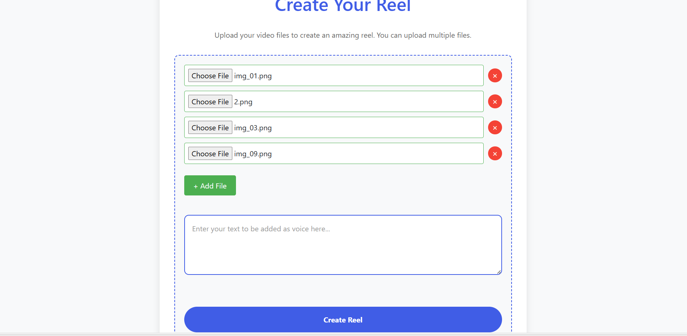
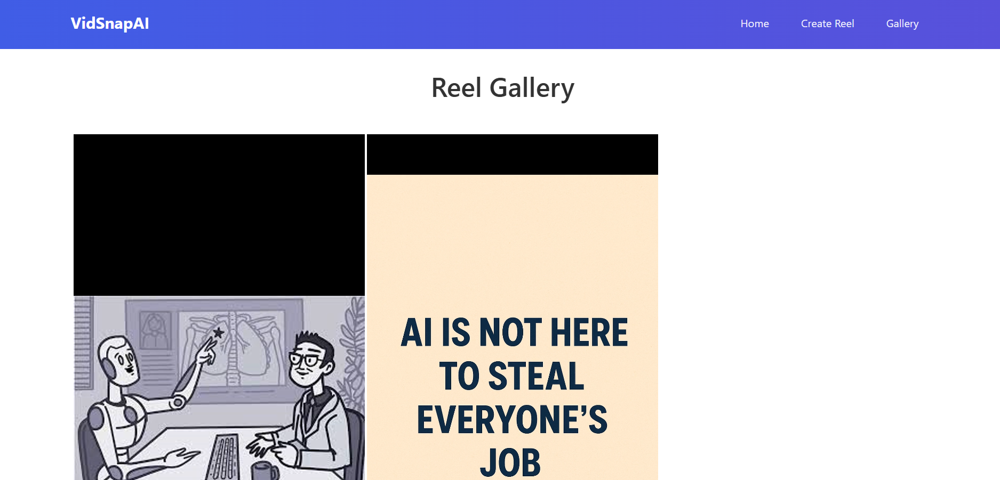

# VidSnapAI 🎥🤖

VidSnapAI is a Flask-based AI web application that automatically creates Instagram-style reels using user-uploaded images and AI-generated voiceovers.

The app allows users to upload multiple images, enter text, and generate a vertical 9:16 reel where the text is converted into natural-sounding speech using AI.

---

## 🚀 Features

- Upload multiple images for reel creation  
- Convert user text into AI-generated voice narration  
- Automatic reel generation in Instagram-friendly format (1080×1920)  
- Background processing using FFmpeg  
- Gallery page to view generated reels  
- UUID-based user isolation for secure file handling  

---

## 🛠️ Tech Stack

- **Backend:** Python, Flask  
- **AI:** ElevenLabs Text-to-Speech API  
- **Video Processing:** FFmpeg  
- **Frontend:** HTML, CSS  
- **Utilities:** UUID, Werkzeug  

---

## 📁 Project Structure

```
VidSnapAI/
├── main.py
├── generate_process.py
├── text_to_audio.py
├── config.py
├── requirements.txt
├── templates/
│   ├── base.html
│   ├── index.html
│   ├── create.html
│   └── gallery.html
├── static/
│   ├── css/
│   ├── reels/
│   └── songs/
├── screenshots/
└── user_uploads/
```


---

## ⚙️ How It Works

1. User uploads images and enters text through the web interface  
2. Flask creates a unique UUID folder for each request  
3. Text is converted into AI-generated speech using ElevenLabs  
4. FFmpeg merges images and audio into a vertical reel  
5. The generated reel is saved and displayed in the gallery  

---

## 🖼️ Screenshots

Screenshots are stored in the `screenshots/` directory.


### Home Page


### Reel Creation Page


### Gallery Page



---

## ▶️ How to Run the Project

# 1️⃣ Install dependencies
pip install -r requirements.txt

# 2️⃣ Run the Flask app
python main.py

# 3️⃣ (Optional) In another terminal, run the background reel processing
python generate_process.py


📌 Requirements

- Python 3.9 or higher
- FFmpeg installed and added to system PATH
- ElevenLabs API key (add it in `config.py`)


🔐 Notes

Do NOT upload user_uploads/, generated reels, or API keys to GitHub

Use .gitignore to exclude runtime and sensitive files

👩‍💻 Author

Akanksha Agre


---


